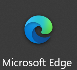

# 浏览器的选择

把这一节内容放在最前面是因为一个好用的浏览器确实对于经常使用网络的用户非常重要。

个人认为一个好用的浏览器至少应该是下面的样子:

* 界面简洁，加载速度快
* 与现代Web技术兼容，不会遇到有网站显示错误的问题
* 拥有强大的扩展系统
* 不会主动干扰用户的浏览体验

如果你还在使用`xx安全浏览器`，`xx极速浏览器`或者`双核浏览器`等浏览器，我建议你卸载他们。
虽然这些浏览器并不会对你的上网有任何实质上的影响(~~不过有可能会造成广告增多等情况~~)，但是我更推荐下面几个浏览器。

## 下载浏览器

* 以下推荐的浏览器的排序顺序均不代表作者推荐程度

### Microsoft Edge

如果你的电脑系统是较新的 win10 或者新笔记本预装的 win11 系统，则这个浏览器应该会直接内置在桌面上
~~没有找到可以去开始菜单~~

[Microsoft Edge 下载地址](https://www.microsoft.com/zh-cn/edge)

### Chrome(谷歌浏览器)

如果你知道如何科学上网并且是一名谷粉的话非常推荐你使用 chrome。

因为如果不会科学上网的话有很多功能不能使用，造成体验不佳

[Chrome 下载地址](https://www.google.com/chrome/)

### Chromium

Chrome 的开源版本，去除了谷歌的服务。

足够精简，大多数功能都需要自己设置

[Chromium 下载地址](https://download-chromium.appspot.com)

### 百分浏览器

如果你无法下载上面的 Edge 可以试试这个。它是 Chromium 内核的一个分支版本，类似 Chrome 但是有一些额外的小功能。

适合国人的使用习惯，集成了一些常用的功能(例如鼠标手势、小号新标签、滚动标签栏等)

[百分浏览器 下载地址](https://www.centbrowser.cn/)

### Firefox(火狐浏览器)

Firefox 是由 mozilla 推出的一款注重用户隐私与安全的浏览器，它完全开源，同时被集成在了很多 Linux 发行版中作为默认浏览器，你可以在下面的地址下载它：

[Firefox 下载地址](https://www.mozilla.org/zh-CN/firefox/)

> 警告\
> 请不要在此网站下载国内定制版火狐浏览器 ~~`https://www.firefox.com.cn/`~~ 它集成了非常多的广告，请在搜索时注意网页域名是否属于 **mozilla**。\
> 如果你不确定自己已经下载的 Firefox 是否是国内定制的火狐浏览器，请卸载并在 Firefox 官方网站重新下载安装。~~一般地，看看有没有广告就很容易发现了。~~

另外如果你对网页开发感兴趣，**Firefox 开发者版**有一些额外的功能可以帮助你开发。

[Firefox 开发者版 下载地址](https://www.mozilla.org/zh-CN/firefox/developer/)

### min browser

一款非常小巧的浏览器，功能简单且纯粹，没有任何乱七八糟的内容，如果你有电子洁癖的话非常推荐。顺带一提，这是一款开源的浏览器。

[min browser 下载地址](https://minbrowser.org/)

## 使用浏览器

上面介绍的浏览器界面都非常简洁，大部分上网操作都是从`地址栏`开始的。

* 最左边是`后退`按钮。有的人只知道按标签页的 `X` 来后退页面(其实是关闭了当前的标签页)

* 从左到右第二个`->` ` 前进`按钮是当你点击几次后退之后，发现后退太多之后想返回的按钮

* 中间是地址栏(用于输入网址-URL)，你只需输入目标网址的url就可以访问到该网站。
* 其中地址栏中高亮的白色内容是该网站的域名，前面对应的https指的是该网站的协议，
  后面指的是当前页面在该网站的位置

## 配置浏览器

大部分设置都在`右上角菜单 > 设置`里，你也可以在设置页面搜索你想要调整的内容。下面是几个常用的设置，不同浏览器的对于设置项目描述可能不同，请自行调整

### 地址栏搜索引擎

推荐`必应(Bing)`或者是`百度`

*如果你会使用科学上网，那么首选`google(谷歌)`*

### 下载

如果你的`C盘`很小，那你可能希望把文件下载到别的位置。你可以在设置里选择路径

### 主页

如果你还是习惯于有一个主页来开始上网，那你可以在设置里手动指定主页。一般叫做`启动时打开页面`。

# 参考资料

[Edge技巧](https://microsoftedgetips.microsoft.com/zh-cn/)
