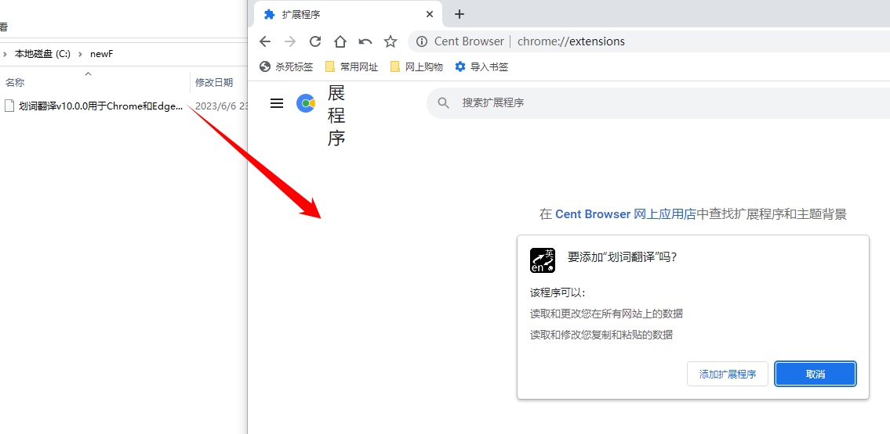
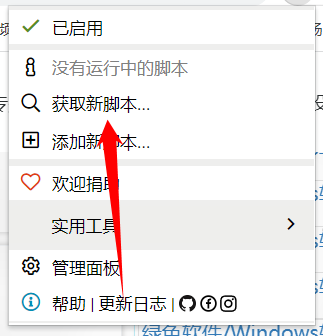
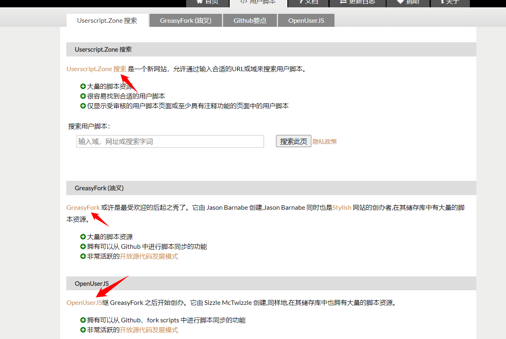
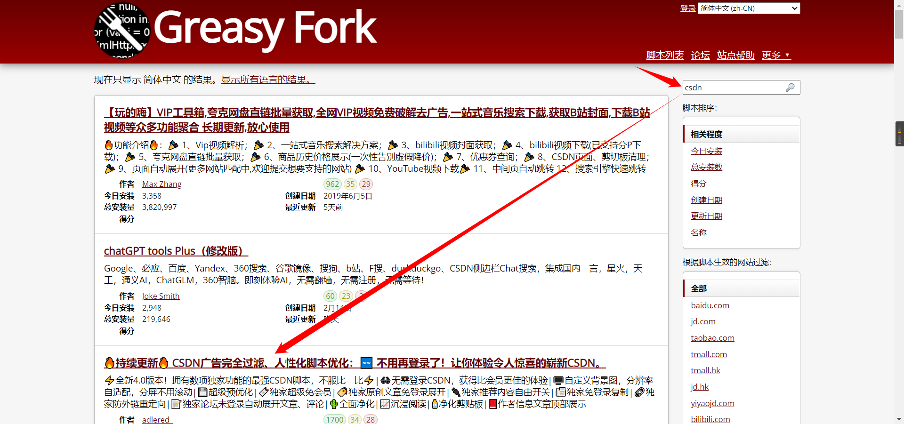
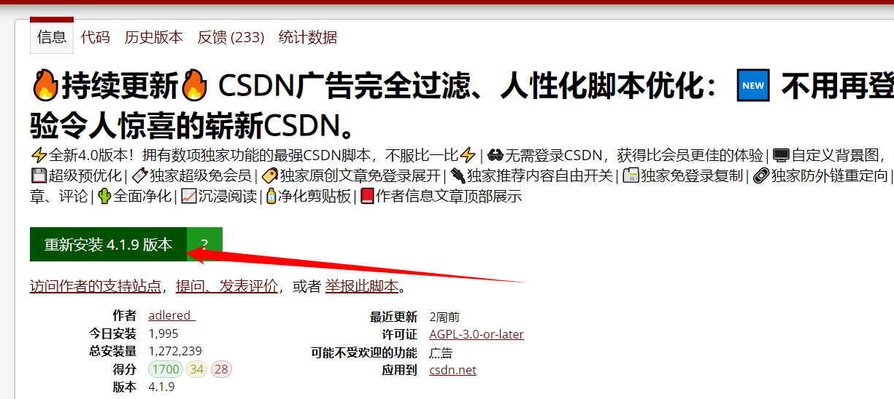

# 浏览器插件推荐
由于越纯净的浏览器携带的功能越精简，你可能需要一些浏览器本不携带的功能，请考虑安装浏览器插件(或者叫`浏览器扩展`)

## 浏览器插件

谷歌有官方的插件[商店](https://chrome.google.com/webstore/category/extensions)，你可以从中安装你想使用的插件(但是要科学上网才可以访问)

推荐列表给出的链接是 google 官方插件网站，你也可以直接 google 某些插件的官方网站来安装插件

## 离线安装方法

如果你能直接从 google 插件商店安装插件请跳过此节

一般情况下，你会有插件的两种存在方式之一即可安装到浏览器中

以 google 系浏览器为例，访问网址`chrome://extensions/`你就可以打开扩展管理页面，依照图片方法拖拽`ctx`后缀的文件至空白处就会提示你是否安装插件，点击添加扩展程序即可安装

### 浏览器插件推荐
* [Adblock Plus](https://chrome.google.com/webstore/detail/adblock-plus-free-ad-bloc/cfhdojbkjhnklbpkdaibdccddilifddb) : 用于广告拦截
* [uBlock Origin](https://chrome.google.com/webstore/detail/ublock-origin/cjpalhdlnbpafiamejdnhcphjbkeiagm) : 用于广告拦截(建议配合)
* [Infinity 新标签页 (Pro)](https://chrome.google.com/webstore/detail/infinity-new-tab-pro/nnnkddnnlpamobajfibfdgfnbcnkgngh) : 用于更改原版浏览器标签页的样式，自定义标签页和主页
* [Tampermonkey(油猴)](https://chrome.google.com/webstore/detail/tampermonkey/dhdgffkkebhmkfjojejmpbldmpobfkfo) : 加载脚本的插件，稍后会详细介绍
* [划词翻译](https://chrome.google.com/webstore/detail/%E5%88%92%E8%AF%8D%E7%BF%BB%E8%AF%91/ikhdkkncnoglghljlkmcimlnlhkeamad) : 如其名

## 油猴插件

什么是油猴插件？

Tampermonkey(中文俗称油猴，官方译名窜改猴)，是一款浏览器上的扩展

用户可以通过Tampermonkey添加和使用脚本，而脚本是一种可以修改网页JavaScript的程序

简而言之就是你可以在油猴插件中添加一些由用户编写的脚本，以实现对某些网站的特点功能的实现

## 安装方法

首先点击油猴插件的图标，会打开下图界面，点击`获取新脚本`

油猴推荐了一些使用人数较多的脚本提供网站，当然你也可以自己找国内的，这里使用 Greasy Fork 进行演示

搜索你想要添加的脚本功能，检索脚本

点击安装后 Tampermonkey 会弹出页面询问是否添加脚本，点击是即可添加插件到 Tampermonkey 中

### 插件推荐
* [CSDN 优化](https://greasyfork.org/zh-CN/scripts/378351-%E6%8C%81%E7%BB%AD%E6%9B%B4%E6%96%B0-csdn%E5%B9%BF%E5%91%8A%E5%AE%8C%E5%85%A8%E8%BF%87%E6%BB%A4-%E4%BA%BA%E6%80%A7%E5%8C%96%E8%84%9A%E6%9C%AC%E4%BC%98%E5%8C%96-%E4%B8%8D%E7%94%A8%E5%86%8D%E7%99%BB%E5%BD%95%E4%BA%86-%E8%AE%A9%E4%BD%A0%E4%BD%93%E9%AA%8C%E4%BB%A4%E4%BA%BA%E6%83%8A%E5%96%9C%E7%9A%84%E5%B4%AD%E6%96%B0csdn) : 清理csdn的广告、破解登录才能复制的功能
* [Bilibili-Evolved](https://raw.githubusercontent.com/the1812/Bilibili-Evolved/master/dist/bilibili-evolved.user.js) : 一款优化 bilibili 网页版的脚本
* [搜索引擎优化](https://greasyfork.org/zh-CN/scripts/14178-ac-baidu-%E9%87%8D%E5%AE%9A%E5%90%91%E4%BC%98%E5%8C%96%E7%99%BE%E5%BA%A6%E6%90%9C%E7%8B%97%E8%B0%B7%E6%AD%8C%E5%BF%85%E5%BA%94%E6%90%9C%E7%B4%A2-favicon-%E5%8F%8C%E5%88%97) : 用于优化搜索引擎搜索结果