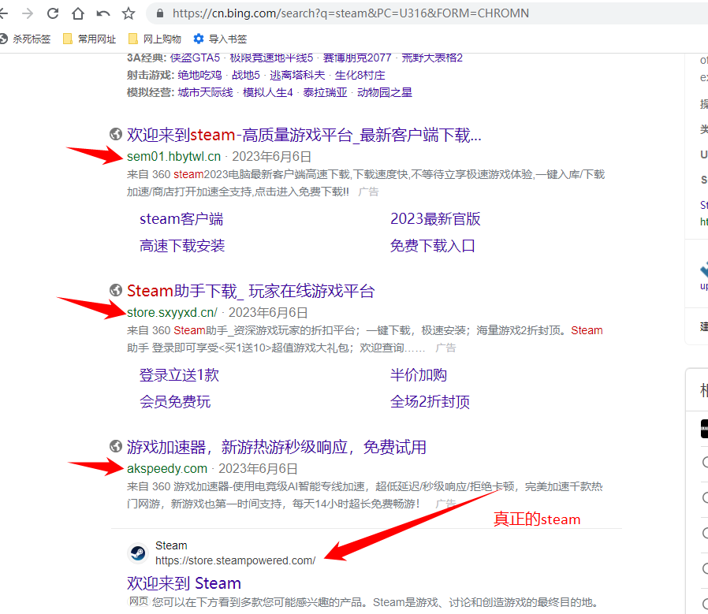
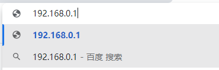
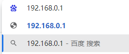
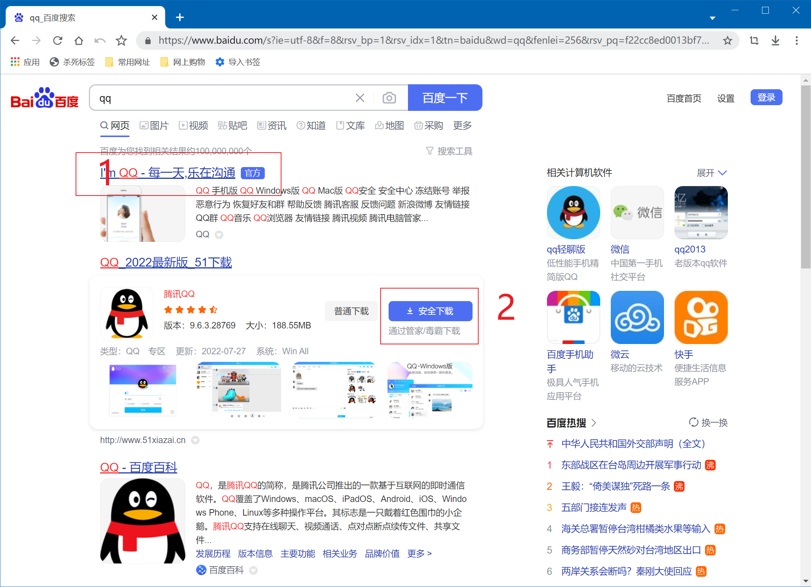
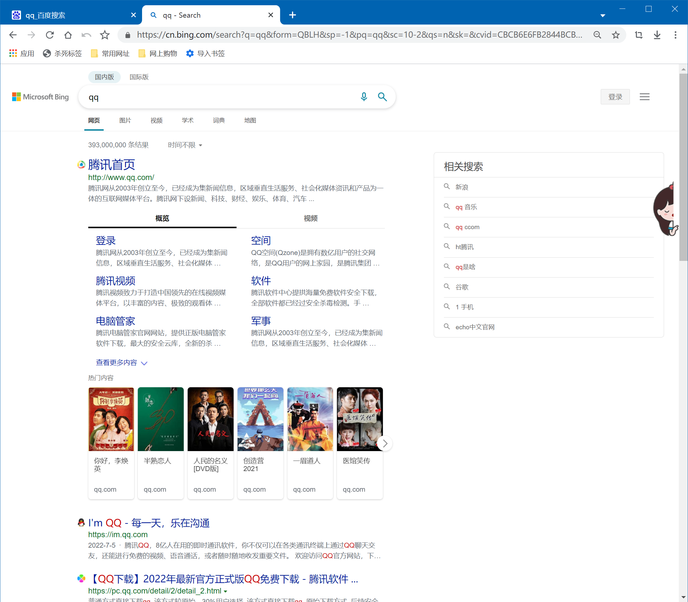
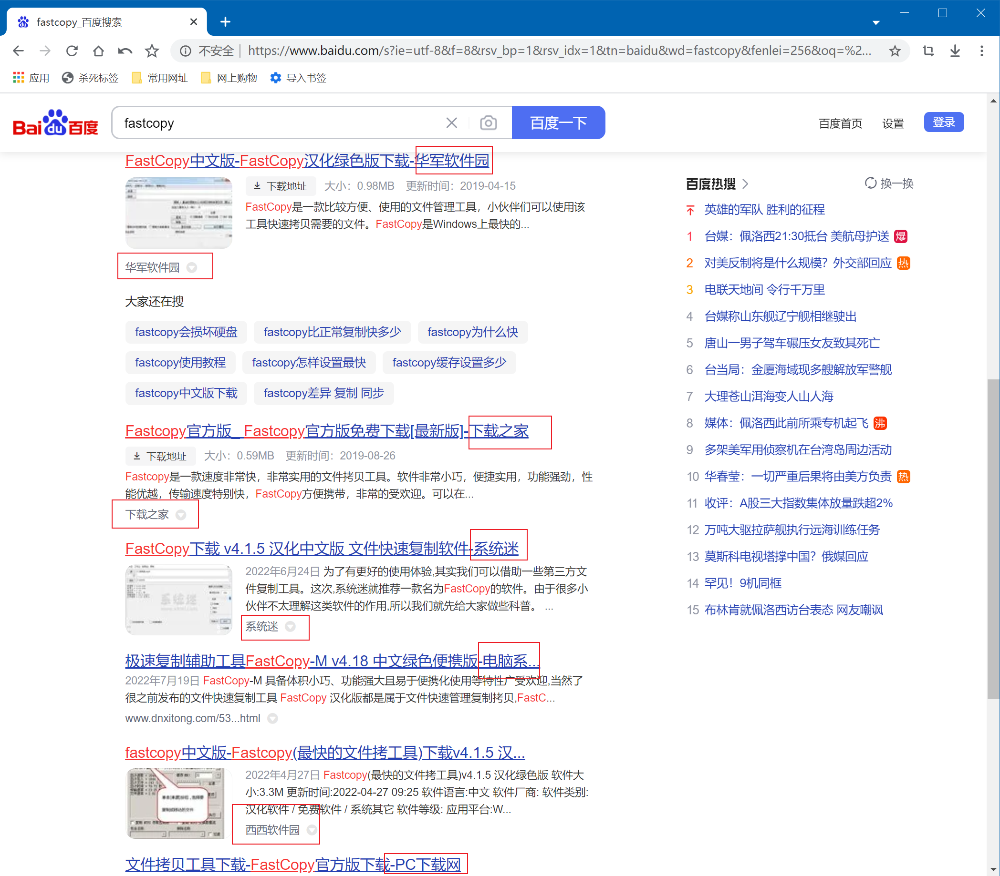
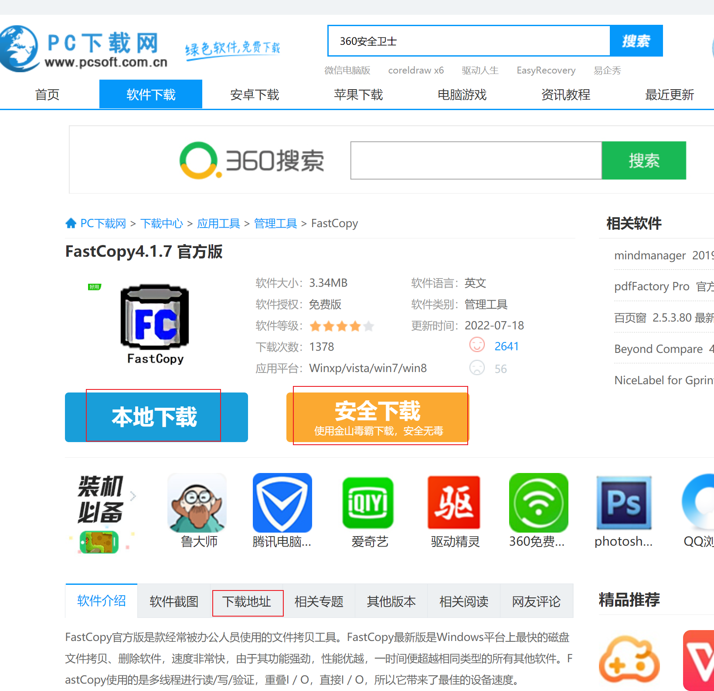
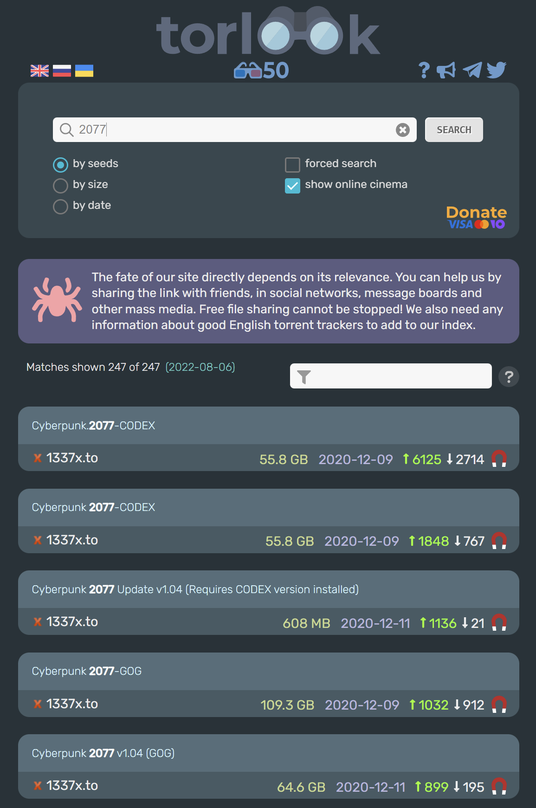

# 引入

前一页介绍的浏览器界面都非常简洁，大部分上网操作都是从`地址栏`开始的。

* 最左边是`后退`按钮。有的人只知道按标签页的 `X` 来后退页面(其实是关闭了当前的标签页)
* 第二个`->`或` 前进`按钮是当你点击几次后退之后，发现后退太多之后想返回的按钮
* 中间是地址栏(用于输入网址-URL)，你只需输入目标网址的url(由协议、域名、路径等组成)就可以访问到该网站。
* 其中地址栏中高亮的白色内容是该网站的域名，前面对应的https指的是该网站的协议，后面指的是当前页面在该网站的路径

## 域名

域名的作用是用于区分是否是你想搜索的网站和仿制网站

如上图你可以看到只有**最后一个网站**才是我们想找的**真正**网站而不是广告或者诈骗网站

但是这种判别方式的前提是你知道网站的官网是什么

如果你的搜索引擎(如某度)找不到域名或难以辨别，那请更换搜索引擎 ~~，这种搜索引擎能搜出来什么优质内容~~

### 如何直接使用网址访问网页

假设路由器的地址为`http://192.168.2.1/` ，而你想登录路由器后台，你进行了以下的操作

请注意以上两张图的细微区别，其中图一使用的是网址直接访问，而图二使用的是搜索引擎查找网页

他们两的不同在于：图二实际上并没有访问`192.168.2.1`的网址而是在互联网上搜索这个文字，不可能跳转到你想访问的网址。所以正确的操作是图一

# 为什么需要搜索引擎？搜索引擎如何使用？

由于在浏览器中直接输入目标网址不太现实 ~~除非你能记住每个网站的网址~~ ，所以我们需要一个东西来帮助我们抵达目标网站 ，这个东西就是搜索引擎

如何使用搜索引擎？这个问题看似十分简单，但是对于很多拿起手机就只使用微博，BiliBili或抖音的人来说并没有那样简单。

本章节将会教你在搜索引擎上找到你真正需要的东西；包括软件，信息，教程和娱乐相关的内容

## 我该使用什么搜索引擎

一般情况下，我个人建议使用Bing或Google。使用Bing国际版搜索英文内容，国内版搜索中文内容。

*请不要使用例如360搜索、搜狗搜索等搜索引擎，不仅大概率搜不到正确的信息而且充斥着很多广告等*

## 软件的搜索和下载

将软件放在最前是因为我们在使用搜索引擎时多半都是需要下载软件。

可以简单按照下面的方式来搜索:

* 对于常规的软件，直接搜索官网下载即可；如果无法访问官网或者是无法下载可以使用下载站，但是一定要找到真实的下载链接(可以通过上面介绍的域名来判断是否为官网)
* 对于需要破解的软件，通常下载站都会提供破解版下载链接，或者在某些论坛都会提供。
* 对于从上面都找不到的软件，或者是被国内版权保护商代理的软件。如果你能使用学校邮箱可以使用学校邮箱尝试申请学生授权。

细心的用户可能会发现Win10系统内自带一个应用商店，但是我在一般情况下不推荐从里面下载软件。~~虽然里面也有一些值得使用的优秀软件~~

下面为大家演示

## 常规软件的搜索和下载

如果你要下载QQ，在搜索引擎搜索`QQ`会得到下面的结果

请问，你应该选择哪一个？

* 如果你选择`1`，恭喜你找到了正确的下载方式
* 如果你选择`2`，说明你可能不太熟悉国内互联网

**请注意:**

* 大多数情况下搜索软件百度将会在第一页内显示`官网`字样，这样的结果通常是没有问题的
* 通常情况下`安全下载`,`高速下载`等字样的链接会在你的电脑上安装捆绑软件
* 如果你选择从官网下载软件，请不要被`最新版`，`官方版`等描述所迷惑，因为你在官网下载的软件通常是最新的官方版
* 有时候排名第一的不一定的官网，需要仔细鉴别广告

下面是Bing的搜索结果，没有官网字样

## 通过下载站下载软件

首先要学会识别什么是下载站

在百度搜索`FastCopy`

红框内的内容通常是网站的标题，如果你看到标题类似图上那样的链接就是下载站。

当你打开下载站的时候，你需要从下载站主页找到真正的软件下载链接。~~近几年情况已有所好转~~

上图的红框部分是你需要选择的地方。根据上面的规则，请**不要点击**安全下载。点击下载链接或本地下载会跳转到下载链接界面。

通常下载站会给出多个链接，但是其实都是一样的，依然是根据上面的规则选择`本地下载`。可能不同下载站的规则不同，但是带有`本地下载`,`xx电信/联通/移动下载`的链接有更大可能性不会下载到捆绑下载器。

下载完成后，你需要检查文件名称:

* 一般情况下下载站给出的下载文件都是压缩文件`.zip .rar .7z`
* 如果你看到有规律的中文文件名，并为`.exe`结尾，你需要小心这个文件可能是捆绑下载器

为什么要当心捆绑下载器: [破坏力堪比勒索病毒！P2P高速下载器才是世界上最恶心的电脑病毒！](https://www.bilibili.com/video/BV15X4y1T73S)

如果你要下载的东西找不到破解版，你可以到[懒得勤快](https://masuit.com/)看看

## 通过论坛下载

很多破解版的软件需要通过论坛找到。因为不是每一个论坛都相同所以这里不给出详细的演示了。

我个人经常去下载软件的论坛是`52破解`，如果你要尝试在这个论坛找你想要的东西可以在搜索引擎搜索`52破解 你想要的东西`。通常软件都会被发布在`『精品软件区』`。但也有可能会在其他分区。

一般来说下载链接都是网盘，如果是百度网盘你可能需要自行想办法高速下载。

## 通过BT下载

BT和上面的下载方式的最大区别是他是去中心化的，每个下载资源的人同时也将下载好的部分传给需要的人。

BT下载必须要安装一个下载器，这里推荐`qBittorrent`。我个人不推荐迅雷，原因如下:

* 在部分情况下迅雷确实能得到较快的下载速度，但是迅雷从不将自己下载好的部分传给别人，这对于整个网络的生态是不好的
* 迅雷软件的界面有较多广告，资源占用也比上面的`qBittorrent`高
* 大部分私有BT站只允许指定的客户端，迅雷不在允许范围内

这里仅仅介绍常用寻找BT资源的网站，关于BT的更多内容请看另一节。

我个人推荐[TorLook](https://gw1.torlook.info/)，这是一个国外的BT网站聚合搜索引擎，涵盖软件，电影，音乐等各种内容，使用这个网站搜索资源时请尽可能使用英文搜索。

