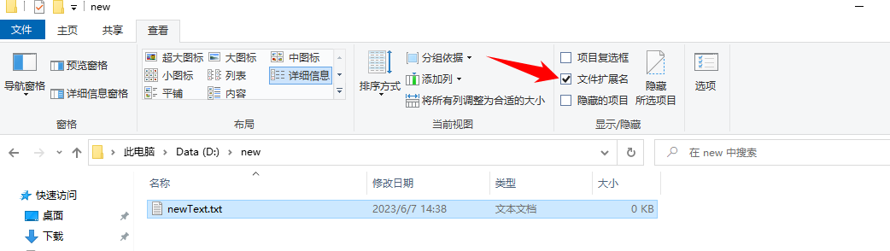

# 文件的组成

以`C:\Windows\notepad.exe` 为例

文件应具有自己的属性，常见属性可以包括：
* 文件名 : notepad
* 文件类型 : exe
* 文件大小 : 196 KB
* 文件的路径 : C:\Windows\notepad.exe
* 建立时间 : 2020年1月1日 10:00:00
* 修改日期 : 最近一次修改文件的日期
* ...

## 文件类型

一个文件是什么类型的文件主要可以通过文件的扩展名来表示(但是不一定完全是)

### 扩展名

以 win10 为例我们可以勾选`查看 > 文件扩展名`来显示文件的扩展名

值得注意是的扩展名的大小写并不影响表的的类型 所以`.TXT` 和 `.txt` 是等价的

常见的扩展名有：

| 扩展名                      | 说明                | 打开方式                          |
|--------------------------|-------------------|-------------------------------|
| .txt                     | 无格式的文本文件          | 记事本                           |
| .html;.htm;.shtml;.xhtml | 带超文本格式的文本文件(网页)   | 浏览器(显示)，记事本等文本编辑工具可以编辑        |
| .doc;.docx               | Word文档            | Word、金山WPS Office             |
| .ppt;.pptx               | PowerPoint演示文稿    | PowerPoint、金山WPS Office       |
| .pdf                     | 电子书格式             | Adobe Reader、Microsoft Edge   |
| .bmp                     | Windows位图文件       | 几乎所有图片查看器、画图                  |
| .jpg;.jpeg               | 有损图像压缩格式          | 几乎所有图片查看器                     |
| .png                     | 有损图像压缩格式          | 几乎所有图片查看器                     |
| .gif                     | 动图格式              | 几乎所有图片查看器                     |
| .ico                     | Windows图标         | 几乎所有图片查看器                     |
| .psd                     | Adobe Photoshop格式 | Adobe Photoshop、ACDSee、XnView |
| .exe                     | 可执行文件             | 双击                            |
| .rar                     | 压缩文档              | 几乎所有解压缩软件                     |
| .zip                     | 压缩文档              | 几乎所有解压缩软件                     |
| .mp4                     | 视频文件              | 几乎所有视频播放器                     |

### 扩展名与文件类型并不是100%对应的

你可以尝试把一个 `.txt` 后缀的文本文件重命名为 `.exe` 后缀，但是当你双击尝试打开时会发现并不能运行

但是文件本身还是一个**文本文件**，而不是一个可执行文件，所以后缀名(扩展名)并不能100%表示文件的类型

# 参考
电脑文件 : https://baike.baidu.com/item/%E7%94%B5%E8%84%91%E6%96%87%E4%BB%B6/21421152

文件格式列表 : https://zh.wikipedia.org/wiki/%E6%96%87%E4%BB%B6%E6%A0%BC%E5%BC%8F%E5%88%97%E8%A1%A8