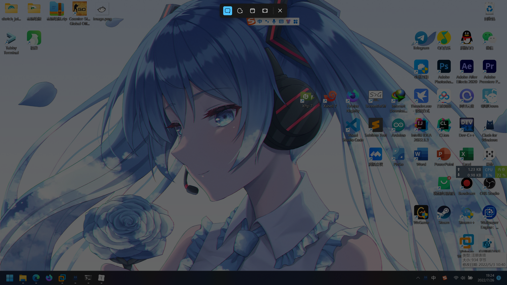
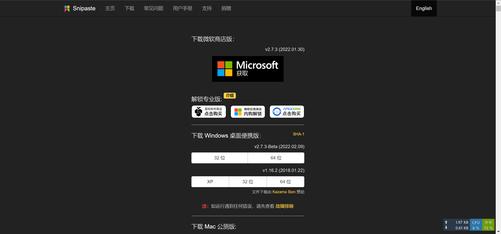

# 关于截图

比较常用的两种截图方式

## QQ截图

默认截图方法是 `ctrl + alt +a`

## 微信截图

按下键盘上的`Alt + A`就可以实现微信截图

## windows自带截图

### 全屏截图

windows的默认全屏截图是键盘上的`PrtSc`这个按键，按下这个键，然后再去QQ群或者聊天框里粘贴，就能看到全屏截图

### 可框选的活动截图

`Win+Shift+S`

效果如下图

# 我推荐的

>  上面的方法，qq和微信需要打开软件才能用，而windows的自带截屏，是有延迟的，如果你想抓拍某个界面，那是没办法用的
>
> 

这时候我就要推荐一下**Snipaste**这个截图软件了

官网：[Snipaste 下载](https://zh.snipaste.com/download.html)

图：

至于它有多好用，大家可以去看少数派的这篇文章

[Windows 上最好的免费截图标注工具：Snipaste - 少数派 (sspai.com)](https://sspai.com/post/34962)

