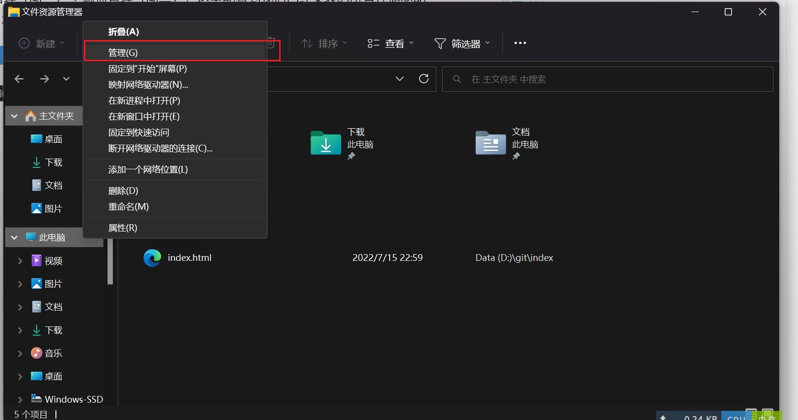

# windows硬盘分区

## 开始：进入磁盘管理

在计算机右键->管理（图一）->磁盘管理（图二）

win11 shift+鼠标右键可调出传统管理

## 压缩卷

一般用于C盘大小不足时，压缩D盘空间，把那部分空间和C盘合并

[Windows如何对硬盘进行分区？ - 知乎 (zhihu.com)](https://zhuanlan.zhihu.com/p/134176556)

## 加硬盘后分区

[新加装的硬盘如何分区？硬盘分区教程 - 知乎 (zhihu.com)](https://zhuanlan.zhihu.com/p/73456495)

## 第三方分区工具

diskgenius

使用详情见官方教程

[软件帮助 - DiskGenius](https://www.diskgenius.cn/help/)